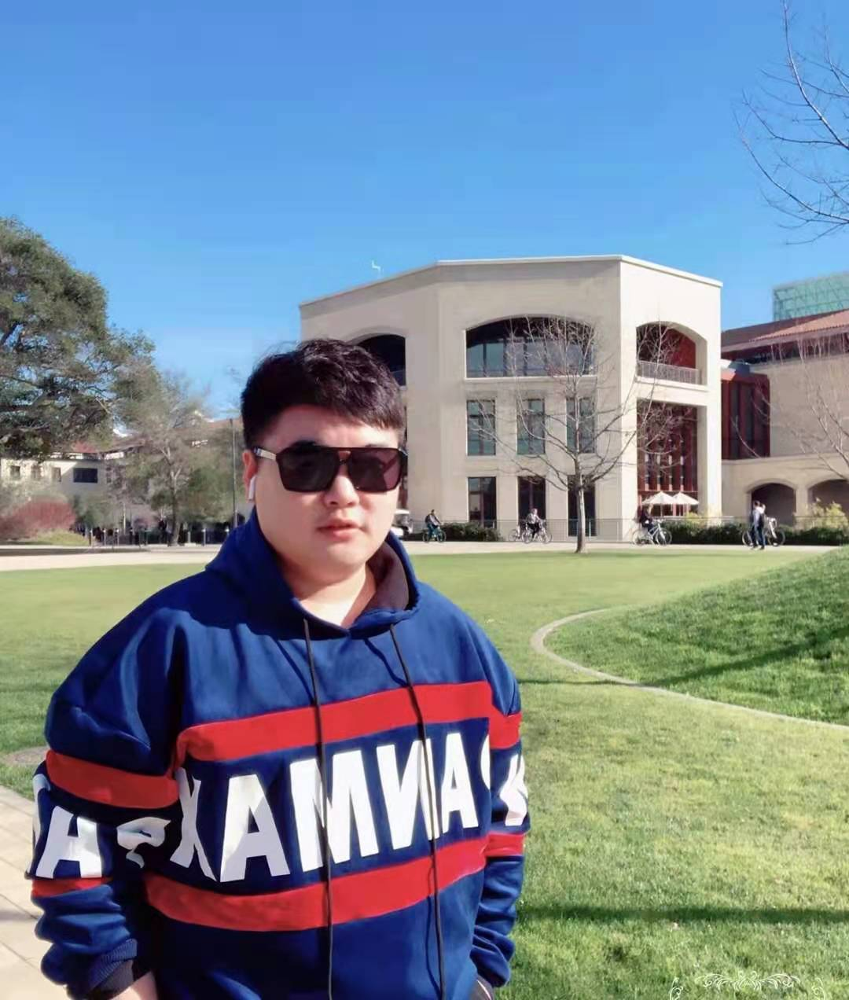
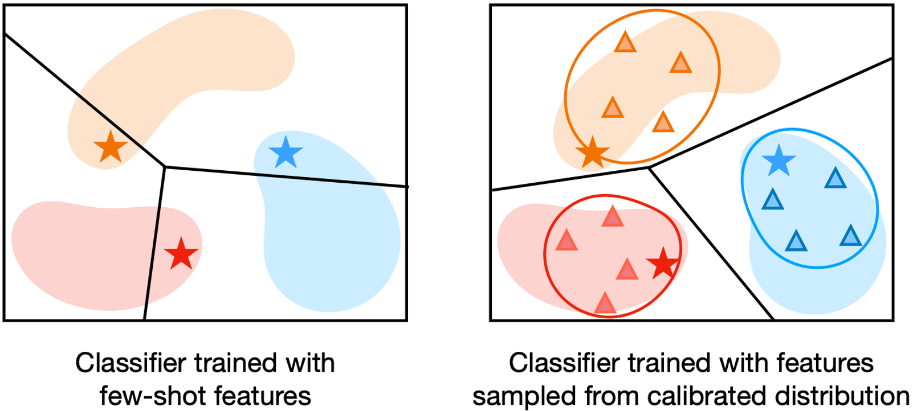
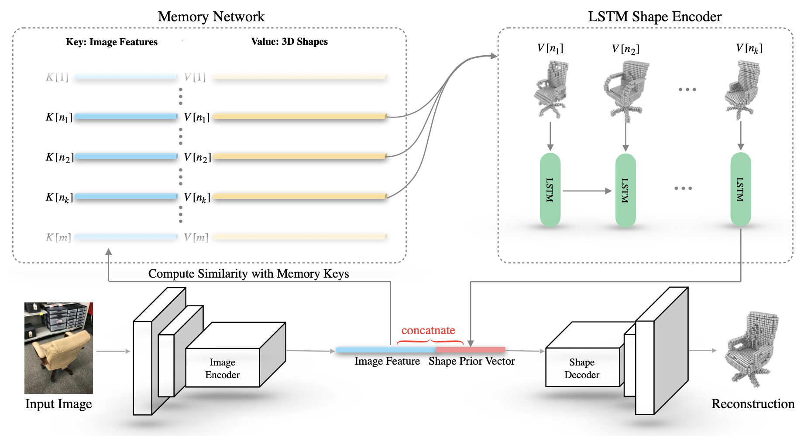
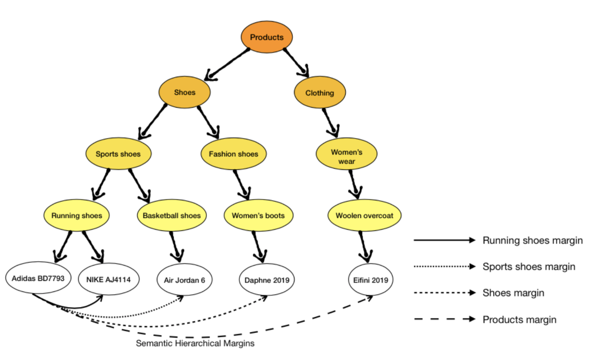

# ucasligang.github.io

<html lang="en">
    <head>
        <meta http-equiv="content-type" content="text/html; charset=utf-8">
        <title>
            Shuo Yang's Homepage
        </title>
        <meta name="viewport" content="width=device-width, initial-scale=1.0"><!-- Le styles -->
        <link href="assets/css/bootstrap.min.css" rel="stylesheet" type="text/css">
        <link href="assets/css/bootstrap-responsive.min.css" rel="stylesheet" type="text/css">
        <link href="assets/css/yangqing.css" rel="stylesheet" type="text/css"><!-- Le HTML5 shim, for IE6-8 support of HTML5 elements -->
        <!--[if lt IE 9]>
    
    <![endif]-->
    </head>
    <body>
        

            

                

                    

                    

                        
                    

                

                

                    <h3>
                        Shuo Yang (杨朔)
                    </h3>
                    <h5>
			    shuo.yang@student.uts.edu.au
                    </h5>
                     
                    

                        I am a first year bachelor-straight-to-PhD student in School of Electrical and Data Engineering, University of Technology Sydney, advised by Prof. <a href="https://profiles.uts.edu.au/Min.Xu">Min Xu</a>. My research interests focus on few-shot learning, meta-learning, and computer vision. 
			I also work closely with <a href="https://www.tmllab.ai/">TML Lab</a> leaded by Prof. <a href="https://tongliang-liu.github.io/"> Tongliang Liu</a>.
		    

		    

			I obtained my bachelor degree from School of Computer Science, Harbin Institute of Technology in 2020, advised by <a href="http://homepage.hit.edu.cn/yaohongxun"> Hongxun Yao</a> and <a href="http://homepage.hit.edu.cn/wangmengzuo"> Wangmeng Zuo</a>.
		    

		    <h5>
			<a target="_blank" href="https://github.com/ShuoYang-1998">GitHub</a> /
		        <a target="_blank" href="https://scholar.google.com/citations?user=xLsQ02cAAAAJ&hl=en">Google Scholar</a> 
		    </h5>

        <h3>
News</h3>
        <ul>
            <li>
03/2021, I was invited by Twitter to give a talk about few-shot learning at <a href="https://cortex.twitter.com"> Twitter Cortex</a> Machine Learning Group. </a>  
</li>
            <li>
03/2021, I will give a talk about few-shot learning at ByteDance AI Lab. </a>  
</li>
            <li>
03/2021, One paper was accepted by CVPR 2021</a>.  
</li>
            <li>
02/2021, I joined ByteDance AI Lab as Research Intern, work with <a href="https://peizesun.github.io">Peize Sun</a> and Yi Jiang. </a>  
</li>
            <li>
01/2021, One paper was accepted as <strong>Oral</strong> by ICLR 2021.</a>  
</li>
            <li>
12/2020, I accepted the invitation to serve as a reviewer for ICML 2021.</a>  
</li>
            <li>
07/2020, I joined the <a href="https://www.uts.edu.au/research-and-teaching/our-research/global-big-data-technologies-centre/our-research/big-data-analytics/visual-and-aural-intelligence-lab-vail/visual-and-aural-intelligence-lab-people">Visual and Aural Intelligence Lab</a>, University of Technology Sydney as a Ph.D. student. </a>  
</li>
            <li>
06/2020, I obtained bachelor degree from Harbin Institute of Technology. </a>   
</li>
        </ul>
	
<!--
 *** Publications ***
-->
                    <!-- 
 (Most recent publications to be added) 
 -->
		  
                    <h3>
                         Publications
                    </h3>
                    

                        
                        

                            

                                
                            

                            <h4>
                                <strong>Free Lunch for Few-shot Learning: Distribution Calibration</strong>
                            </h4>
			    <strong>Shuo Yang</strong>, Lu Liu, Min Xu 
			     <b>ICLR 2021 (Oral)</b>
                            <a href="https://arxiv.org/pdf/2101.06395">arXiv</a> /
			    <a href="https://github.com/ShuoYang-1998/Few_Shot_Distribution_Calibration">Code</a> /
                <a href="">Slides(todo)</a> /
                <a href="">Video(todo)</a> /
		<a href="./assets/bibtex/fs_dc.txt">BibTex</a>
                        

		     

          
                    

                        
                        

                            

                                
                            

                            <h4>
                                <strong>Single-view 3D Object Reconstruction from Shape Priors in Memory</strong>
                            </h4>
                <strong>Shuo Yang</strong>, Min Xu, Haozhe Xie, Stuart Perry, Jiahao Xia 
                 <b>CVPR 2021</b>
                            <a href="https://arxiv.org/pdf/2003.03711.pdf">arXiv</a> /
		<a href="./assets/bibtex/mem3d.txt">BibTex</a>
                        

             

          
                    

                        
                        

                            

                                
                            

                            <h4>
                                <strong>Adaptive Semantic-Visual Tree for Hierarchical Embeddings</strong>
                            </h4>
                <strong>Shuo Yang</strong>, Wei Yu, Ying Zheng, Tao Mei,  
                 <b>ACM MM 2019 (Short Oral)</b>
                            <a href="https://arxiv.org/pdf/2003.03707">arXiv</a> /
		<a href="./assets/bibtex/mm19.txt">BibTex</a>
                        

             

        <h3>
Academic Services</h3>
        <ul>
            <li>
ICML 2021. </a>  
</li>
        </ul>

	

        
	

<!-- Footer -->
                    

                    

                        

                            

                                

                                    modified from <a target="_blank" href="http://daggerfs.com/">© Yangqing Jia 2013</a>
                                

                            

                        

                    

                

            

        

    </body>
</html>
